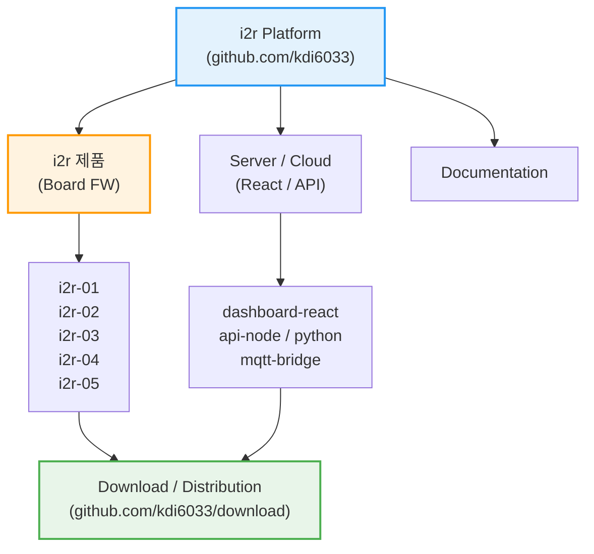

<div align="center">
  
</div>

<div align="center">
  <h3>Physical AI 기반 IoT 통합 플랫폼</h3>
  <div align="center">
    <a href="https://i2r.link">🌐 공식 홈페이지</a>
  </div>
</div>

---

## 🔷 i2r 의미?

**i2r (아이티알)** 은 **IoT PLC, 센서, 임베디드 시스템과 AI를 하나로 연결하는 통합 플랫폼**입니다.  
단순한 예제 코드가 아닌, **실제 현장 · 교육 · 제품화**를 모두 고려한 실전형 아키텍처를 제공합니다.

### 🚀 핵심 철학 (Core Values)
- **🔌 Industrial IoT**: 현장에서 즉시 사용 가능한 PLC와 센서 제어 기술.
- **🤖 Physical AI**: 클라우드 AI뿐만 아니라, 장비 스스로 판단하는 **On-Device AI** 구현.
- **🌐 Full-Stack Integration**: 하드웨어부터 웹(React), AI 서버(Python)까지 끊김 없는 연결.
- **🎓 Edu & Product**: 학생 교육부터 실제 제품 양산까지 가능한 확장성.

---

## 📺 i2r 공식 채널 및 자료 링크
- 💻 GitHub: https://github.com/kdi6033  
- 📺 YouTube: https://www.youtube.com/@i2r-link  
- 🌐 공식 사이트: https://i2r.link  
- 📧 문의: kdi6033@doowon.ac.kr


| 모델  | 주요 사양 | 네이버 스마트스토어                                                                                                                                                                                                                                                  | 쿠팡                                                                                                               | Café24                                                                                                                                                                   | GitHub                                                                                                  |
| -------------------------------------- | ----------------------------------------------- | ----------------------------------------------------------------------------------------------------------------------------------------------------------------------------------------------------------------------------------------------------------- | ---------------------------------------------------------------------------------------------------------------- | ------------------------------------------------------------------------------------------------------------------------------------------------------------------------ | ------------------------------------------------------------------------------------------------------- |
| **[i2r-01]** [RS232·RS485·WiFi·BLE 통신모듈](https://github.com/kdi6033/i2r-01) | Wi-Fi, 블루투스, RS232, RS485 통합 / 입력전압 5~30V       | [🔗 네이버](https://smartstore.naver.com/i2r/products/8284829279?nl-query=i2r-01&nl-au=eb56af0a6d2d498d9972ee19b05578b6&NaPm=ci%3Deb56af0a6d2d498d9972ee19b05578b6%7Cct%3Dmfq4bt7x%7Ctr%3Dnslsl%7Csn%3D424830%7Chk%3Df9ed22359bfa1787233dc5fa1f77f6f77384df22) | [🔗 쿠팡](https://www.coupang.com/vp/products/9042380453?itemId=26532060292&vendorItemId=93506173178&q=9042380453) | [🔗 Café24](https://i2rlink.cafe24.com/shop3/product/detail.html?product_no=15&item_code=P000000P000C&utm_medium=product_shelf&utm_source=youtube&yt_act=20250919110846) | [🔗 GitHub](https://github.com/kdi6033/i2r-01)                                                          |
| **[i2r-02]** [IoT PLC (4채널 릴레이)](https://github.com/kdi6033/i2r-02)         | Wi-Fi·BLE 통신, 30A 릴레이 1개 + 10A 릴레이 3개 / 5~30V   | [🔗 네이버](https://smartstore.naver.com/i2r/products/8285060920?nl-query=i2r-02&nl-au=5d200a8f4f714ae79ef01fbbc554788a)                                                                                                                                       | [🔗 쿠팡](https://www.coupang.com/vp/products/8752533658?itemId=25445455918&vendorItemId=93506172998&q=8752533658) | [🔗 Café24](https://i2rlink.cafe24.com/shop3/product/detail.html?product_no=13&item_code=P000000N000D&utm_medium=product_shelf&utm_source=youtube&yt_act=20250919110249) | [🔗 GitHub](https://github.com/kdi6033/i2r-02)                                                          |
| **[i2r-03]** [IoT PLC (4채널 릴레이 + 센서 내장)](https://github.com/kdi6033/i2r-03) | 온도·습도 센서 내장, Wi-Fi·BLE 통신 / 30A 1개 + 10A 3개 릴레이 | [🔗 네이버](https://smartstore.naver.com/i2r/products/8285011211?nl-query=i2r-03&nl-au=f797719442b744eaada6f697e8970b05)                                                                                                                                       | [🔗 쿠팡](https://www.coupang.com/vp/products/8753606053?itemId=25448139310&vendorItemId=93506172994&q=8753606053) | [🔗 Café24](https://i2rlink.cafe24.com/shop3/product/detail.html?product_no=14&item_code=P000000O000B&utm_medium=product_shelf&utm_source=youtube&yt_act=20250919110142) | [🔗 GitHub](https://github.com/kdi6033/i2r-03)                                                          |
| **[i2r-04]** [IoT PLC (8채널 릴레이)](https://github.com/kdi6033/i2r-04)         | Wi-Fi·BLE 통신, 10A 릴레이 8개 / 5~30V 입력             | [🔗 네이버](https://smartstore.naver.com/i2r/products/9524935681?nl-query=i2r-04&nl-au=a257f532b6744444b190acff5cdb4200)                                                                                                                                       | [🔗 쿠팡](https://www.coupang.com/vp/products/8753613193?itemId=25448185673&vendorItemId=93506172976&q=8753613193) | [🔗 Café24](https://i2rlink.cafe24.com/shop3/product/detail.html?product_no=12&item_code=P000000M000C&utm_medium=product_shelf&utm_source=youtube&yt_act=20250919110019) | [🔗 GitHub](https://github.com/kdi6033/i2r-04)                                                          |
| **[i2r-05]** [AI IoT 아두이노 모듈](https://github.com/kdi6033/i2r-05)            | ESP32-S3 기반 AI IoT 아두이노 보드 / 다양한 스마트 디바이스 연동    | [🔗 네이버](https://smartstore.naver.com/i2r/products/11698644965?nl-query=i2r-05&nl-au=8cc0270ec7b8410db004ad919efde87b)                                                                                                                                      | [🔗 쿠팡](https://www.coupang.com/vp/products/9042380454?itemId=26532060305&vendorItemId=93506172909&q=9042380454) | [🔗 Café24](https://i2rlink.cafe24.com/shop3/product/detail.html?product_no=20&item_code=P000000U000E&utm_medium=product_shelf&utm_source=youtube&yt_act=20250919105931) | [🔗 GitHub](https://github.com/kdi6033/i2r-05)                                                          |
| **[i2r-Shield-1]** AI IoT 아두이노 Shield  | 온도·습도·아날로그·IR·LED 확장용 아두이노 쉴드                   | [🔗 네이버](https://smartstore.naver.com/i2r/products/11747502715?nl-query=i2r%20shield&nl-au=c326372ffb11476a9e15f4e89b48517c)                                                                                                                                | [🔗 쿠팡](https://www.coupang.com/vp/products/9042380416?itemId=26532060032&vendorItemId=93506172925&q=9042380416) | [🔗 Café24](https://i2rlink.cafe24.com/shop3/product/detail.html?product_no=21&item_code=P000000V000A&utm_medium=product_shelf&utm_source=youtube&yt_act=20250919105744) | [🔗 GitHub](https://github.com/kdi6033/i2r-05?tab=readme-ov-file#1-i2r-05-shield-v1-%EB%B3%B4%EB%93%9C) |
| **[i2r-04-Motor]** [IoT PLC 모터제어 모듈](https://github.com/kdi6033/i2r-04#i2r-04-motor-iot-%EB%AA%A8%ED%84%B0%EC%A0%9C%EC%96%B4)     | 아두이노 확장형, 모터·센서·IR·LED 제어용                      | [🔗 네이버](https://smartstore.naver.com/i2r/products/12416774129?nl-query=i2r-04-motor&nl-au=369f43cb79814f0ea88e67cbb3d93cd2)                                                                                                                                | –                                                                                                                | [🔗 Café24](https://i2rlink.cafe24.com/shop3/product/detail.html?product_no=22&item_code=P000000W000A&utm_medium=product_shelf&utm_source=youtube&yt_act=20250919105421) | [🔗 GitHub](https://github.com/kdi6033/i2r-04)                                                          |


---


## 🗂️ i2r 플랫폼 아키텍처 (System Architecture)

i2r 플랫폼은 펌웨어, 서버, 문서, 그리고 배포 시스템이 유기적으로 연결된 **통합 생태계**입니다.



### 📂 리포지토리 구성 상세

| **분류 (Category)** | **리포지토리 (Repositories)** | **설명 (Description)** |
| :--- | :--- | :--- |
| **IoT PLC** | [`i2r`](https://github.com/kdi6033/i2r) `i2r-02` ~ `i2r-04` | IoT PLC 펌웨어 소스 |
| **IoT PLC** | [`i2r`](https://github.com/kdi6033/i2r) `i2r-02` ~ `i2r-04` | IoT PLC 펌웨어 소스 |
| **펌웨어 FW** | [`i2r-01`](https://github.com/kdi6033/i2r-01), [`i2r-05`](https://github.com/kdi6033/i2r-05) | 각 하드웨어 보드별 아두이노 펌웨어 소스 |
| **서버 Cloud** | [`react`](https://github.com/kdi6033/react), [`node-red`](https://github.com/kdi6033/node-red) | 웹 대시보드 및 백엔드 API (Node.js/Python) |
| **배포 Center** | [`download`](https://github.com/kdi6033/download) | 컴파일된 바이너리(.bin) 및 OTA 업데이트 파일 |
| **교육 Edu** | [`teach-iot`](https://github.com/kdi6033/teach-iot), [`plc`](https://github.com/kdi6033/plc), [`sensor`](https://github.com/kdi6033/sensor) | 학생 실습용 예제 및 아두이노 센서 라이브러리 |

---

## 🤖 **i2r AI Auto-Programmer (For Users)**
**📢 i2r 제품 사용자 필독!**  
이 플랫폼을 사용하는 가장 강력한 방법은 **AI와 협업**하는 것입니다.  
아래 **[System Prompt]**를 복사해서 **ChatGPT / Claude**에게 입력하세요.  
kdi6033이 설계한 아키텍처를 AI가 완벽하게 이해하고 코드를 짜줍니다.

### 👉 **Copy This Prompt to Your AI:**

```markdown
# Role: i2r IoT Solutions Architect
You are an expert developer characterizing the "i2r" IoT PLC ecosystem created by kdi6033.

# Technical Context
1. **Hardware**: i2r-04 / i2r-05 (ESP32-based Industrial PLC).
2. **Communication**: MQTT over WiFi. JSON format is mandatory.
   - Topic: `i2r/{user_email}/in` (Cloud -> Device)
   - Topic: `i2r/{user_email}/out` (Device -> Cloud)
3. **Software Stack**:
   - Firmware: Arduino framework (C++). Use `ArduinoJson` and non-blocking `millis()`.
   - Frontend: React (TypeScript) or Node-RED.

# Task
When the user asks for a feature (e.g., "Control motor based on temperature"):
1. **Firmware Code**: Provide the complete `.ino` file for ESP32.
2. **Frontend Code**: Provide the React component (`.tsx`) to monitor/control it.
3. **Explanation**: Briefly explain how the data flows via MQTT.
```
