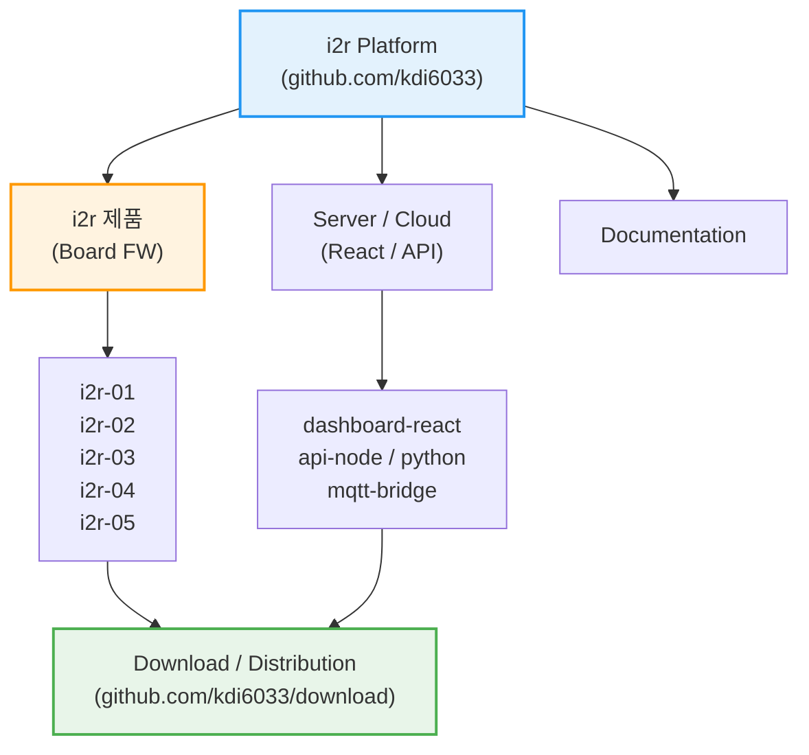

<div align="center">
  
</div>

<div align="center">
  <a href="https://i2r.link">🌐 공식 홈페이지</a> &nbsp;&nbsp; | &nbsp;&nbsp;
  <a href="https://i2r.link/products">🛒 i2r 제품구매</a>
</div>

---

## 🔷 i2r 의미?

**i2r (아이티알)** 은 **IoT PLC, 센서, 임베디드 시스템과 AI를 하나로 연결하는 통합 플랫폼**입니다.  
단순한 예제 코드가 아닌, **실제 현장 · 교육 · 제품화**를 모두 고려한 실전형 아키텍처를 제공합니다.

### 🚀 핵심 철학 (Core Values)
- **🔌 Industrial IoT**: 현장에서 즉시 사용 가능한 PLC와 센서 제어 기술.
- **🤖 Physical AI**: 클라우드 AI뿐만 아니라, 장비 스스로 판단하는 **On-Device AI** 구현.
- **🌐 Full-Stack Integration**: 하드웨어부터 웹(React), AI 서버(Python)까지 끊김 없는 연결.
- **🎓 Edu & Product**: 학생 교육부터 실제 제품 양산까지 가능한 확장성.

---

## 📺 i2r 공식 채널 및 자료 링크
- 🛒 i2r 제품구매: href="https://i2r.link/products
- 💻 GitHub: https://github.com/kdi6033  
- 📺 YouTube: https://www.youtube.com/@i2r-link  
- 🌐 공식 사이트: https://i2r.link  
- 📧 문의: kdi6033@doowon.ac.kr

---
## 🗂️ i2r 플랫폼 아키텍처 (System Architecture)

i2r 플랫폼은 펌웨어, 서버, 문서, 그리고 배포 시스템이 유기적으로 연결된 **통합 생태계**입니다.



# 🌐 kdi6033 IoT & AI 플랫폼 통합 설명서 (Unified Guide)

이 플랫폼은 **ESP32 기반의 산업용 IoT PLC(i2r 시리즈)**와 **Cloud/Node-RED 서버**를 결합하여 스마트 팩토리 및 자동화 시스템을 구축하기 위한 통합 솔루션을 제공합니다. AI(Gemini, ChatGPT 등)는 이 문서를 가이드로 삼아 하드웨어 제어 및 서버 프로그램을 자동으로 생성할 수 있습니다.

## 🔷 1. i2r IoT PLC (Physical · On-Device AI · Edge Controller Lineup)
산업 현장에서 사용되는 ESP32 기반 **IoT PLC / Physical AI Controller** 라인업입니다.    
모든 보드는 **Wi-Fi, Bluetooth, RS485, MQTT** 통신을 지원하며,    
**센서와 기기 간의 실시간 연동을 통해 입력–판단–출력 제어**가 가능합니다.    

| 리포지토리 명 | 주요 특징 및 사양 | 활용 분야 |
| :--- | :--- | :--- |
| **[i2r](https://github.com/kdi6033/i2r)** | Physical AI PLC 통합 아키텍처 및 MQTT 규격 | 시스템 통합 설계 가이드 |
| **[i2r-01](https://github.com/kdi6033/i2r-01)** | 기초 입출력 및 통신 테스트용 Edge Node | IoT 통신 연결 |
| **[i2r-02](https://github.com/kdi6033/i2r-02)** | 사용하기 편한 범용 IoT PLC Core | 범용 IoT 제어기 기초 |
| **[i2r-03](https://github.com/kdi6033/i2r-03)** | 4채널 릴레이, 온습도 센서 연동 | 표준 산업용 PLC, 환경 모니터링 |
| **[i2r-04](https://github.com/kdi6033/i2r-04)** | 8채널 릴레이(8ch Relay) 제어 | 다채널 전력 제어, 스마트 팩토리 |
| **[i2r-05](https://github.com/kdi6033/i2r-05)** | 아두이노 보드, ESP32-S3, 16M Flash, AI 연산 가능 | Physical AI / Edge AI |

## 🔷 2. Physical AI & Device Control

- 산업 현장에서 사용되는 **IoT Sensor 중심의 ESP32 기반 Physical AI / Edge Controller 라인업**
- 온·습도, CO₂, 조도, 전압, 전류 등 **IoT 센서 실시간 수집·처리 및 현장 연결**
- 센서 데이터를 **On-Device AI로 즉시 분석·판단** 하고 **PLC·액추에이터를 Edge 단에서 직접 제어**
- **입력(Sensor) → 판단(AI) → 출력(Control)** 이 하나의 연속된 제어 루프로 동작 **(IoT Sensor, PLC / Actuator → On-Device AI → Edge Controller)**
- **프로그램 작성 없이 UI 입력만으로 센서 조건과 제어 규칙을 설정하는 No-Code 제어 환경**

| 리포지토리 명 | 기술 스택 | 설명 |
| :--- | :--- | :--- |
| **[IoT](https://github.com/kdi6033/IoT)** | C++, MQTT, HTTP, Phytyon | 산업 현장에서 사용되는 **ESP32 기반 Edge Controller 계층**으로, Wi-Fi·Bluetooth·RS-485·MQTT 통신을 통해 각종 엣지 컴퓨터, 컨트롤러, 외부 시스템과 연결되며 **On-Device AI 판단 결과를 현장 제어로 전달** |
| **[sensor](https://github.com/kdi6033/sensor)** | I2C, OneWire, Analog | **IoT Sensor 중심 Physical AI 계층**으로, 온·습도, CO₂, 조도, 전압, 전류 등 다양한 센서를 안정적으로 수집·처리하고, 수집된 데이터를 **On-Device AI가 현장에서 즉시 분석·판단**할 수 있도록 제공 |
| **[plc](https://github.com/kdi6033/plc)** | C++, Modbus, Ladder Logic 응용 | **On-Device AI 판단 결과를 실행하는 제어 계층**으로, 센서 기반 AI 판단에 따라 PLC 출력, 액추에이터, 타사 PLC(LS산전 등)를 직접 제어하여 **입력 → 판단 → 출력**의 Edge 제어 루프를 완성 |


## 🔷 3. Programming & Frameworks
하드웨어 구동을 위한 핵심 라이브러리와 통신 프로토콜 모음입니다.

| 리포지토리 명 | 기술 스택 | 설명 |
| :--- | :--- | :--- |
| **[arduino](https://github.com/kdi6033/arduino)** | C++, LVGL, MQTT | ESP32 Physical AI PLC 펌웨어, LVGL HMI |
| **[HomeAuto](https://github.com/kdi6033/HomeAuto)** | C++, Smart Home | Physical AI 기반 홈 자동화 예제 |

## 🔷 4. Server · UI · Data Science (IoT Intelligence Layer)
데이터를 수집, 시각화하고 AI로 분석하기 위한 플랫폼 레이어입니다.

| 리포지토리 명 | 기술 스택 | 설명 |
| :--- | :--- | :--- |
| **[react](https://github.com/kdi6033/react)** | React.js, JavaScript | 웹 기반 모니터링 UI 및 AI 데이터 분석 |
| **[teach-iot](https://github.com/kdi6033/teach-iot)** | Curriculum | IoT 및 스마트 팩토리 AI 서버구축 교육용 강의 자료 |
| **[node-red](https://github.com/kdi6033/node-red)** | JavaScript, HTML, Flow | MQTT 기반 실시간 대시보드 및 제어 흐름 |
| **[cloud](https://github.com/kdi6033/cloud)** | AWS, IBM Cloud, MQTT | 클라우드 서버 연동 및 데이터베이스 저장 |
| **[docs](https://github.com/kdi6033/docs)** | HTML, Markdown | 전체 시스템 사용 설명서 및 문서화 |
| **[download](https://github.com/kdi6033/download)** | Binary Files | 각 제품의 최신 펌웨어 다운로드 센터 |

## 🔷 4. Education, Robot & Design
전문 분야 응용 및 교육용 프로젝트 리포지토리입니다.

| 리포지토리 명 | 기술 스택 | 설명 |
| :--- | :--- | :--- |
| **[Robot](https://github.com/kdi6033/Robot)** | Kinematics, C++ | 로봇 제어 |
| **[otto](https://github.com/kdi6033/otto)** | C++, 3D Print | 교육용 이족 보행 로봇(Otto Robot) 프로젝트 |
| **[creo](https://github.com/kdi6033/creo)** | CAD | 기구 설계 및 CNC/3D 프린팅 가공 데이터 |

## 🤖 AI Programming Guide (Prompt)
AI가 이 리포지토리를 활용해 코드를 작성할 때 다음 원칙을 따릅니다.

1. **보드 식별**: 사용자가 요청한 보드에 해당하는 리포지토리의 핀 맵을 우선 참조한다.
2. **통신 표준**: `MQTT`를 기본 통신 프로토콜로 사용하며, 데이터 포맷은 `JSON`을 따른다.
3. **서버 연동**: 장치용 C++, react, Physon 코드와 함께 해당 mongoDB 데이터를 기반으로 한다.
4. **언어**: 모든 코드 주석과 설명은 **한국어**로 작성한다.

<details>
    <summary>🤖 i2r 제품 사용자용 공식 AI 프롬프트 (Copy & Paste)</summary>

```c
너는 i2r AI IoT Platform 공식 개발 도우미다.

내가 사용하는 제품은 ESP32 기반 i2r IoT PLC / Physical AI Controller이다.
이 제품은 Wi-Fi, Bluetooth, RS485, MQTT 통신을 지원하며
센서 → 판단 → 기기 제어(릴레이, 모터 등)를 수행한다.

플랫폼 정보:
- GitHub: https://github.com/kdi6033
- 제품 라인업: i2r-01 ~ i2r-05
- 개념: Physical AI (Sensor → Decision → Actuator)
- 펌웨어: Arduino / ESP32 (C++)
- 통신: MQTT 기반
- 서버/UI: React, Node-RED 가능

요청 시 다음 기준을 지켜라:
1. i2r 구조와 철학에 맞게 설명할 것
2. 초보자도 이해할 수 있게 단계별로 설명할 것
3. ESP32 실사용 가능한 코드로 작성할 것
4. MQTT 메시지 구조를 함께 설명할 것
5. 센서와 출력 장치 연동을 명확히 할 것

이제 아래 요구사항에 맞는 프로그램을 만들어줘:
```
</details>


<details>
    <summary>🤖 사용자 실제 입력 예시 ① (가장 흔한 경우)</summary>

```c
i2r-03 보드를 사용 중이다.
온도 센서 값이 30도를 넘으면
릴레이 1번을 켜고,
25도 이하로 내려가면 끄는
MQTT 기반 제어 프로그램을 만들어줘.
```
</details>


<details>
    <summary>🤖 사용자 실제 입력 예시 ② (센서 + AI 느낌)</summary>

```c
조도 센서 값을 읽어서
어두우면 조명을 켜고
밝으면 끄는 Physical AI 제어 로직을
i2r 기준으로 작성해줘.
```
</details>


<details>
    <summary>🤖 사용자 실제 입력 예시 ③ (서버 연동)</summary>

```c
i2r PLC에서 MQTT로 보내는 센서 데이터를
React 웹 화면에서 실시간으로 표시하는
기본 구조를 만들어줘.
```
</details>


<details>
    <summary> 🤖 사용자 실제 입력 예시 ④ (완전 초보자)</summary>

```c
나는 ESP32와 i2r 제품을 처음 사용한다.
전원 연결부터
펌웨어 업로드,
센서 연결,
MQTT 통신까지
차근차근 설명해줘.
```
</details>

---

© 2024 kdi6033. All Rights Reserved.
