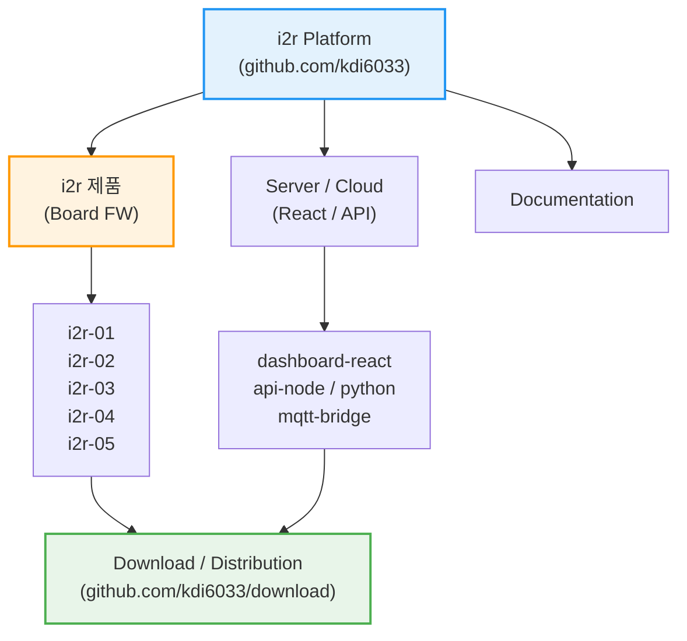

  

  <h3>Physical AI 기반 IoT 통합 플랫폼</h3>
  

    <a href="https://i2r.link">🌐 공식 홈페이지</a>
  

---

## 🔷 i2r 의미?

**i2r (아이티알)** 은 **IoT PLC, 센서, 임베디드 시스템과 AI를 하나로 연결하는 통합 플랫폼**입니다.  
단순한 예제 코드가 아닌, **실제 현장 · 교육 · 제품화**를 모두 고려한 실전형 아키텍처를 제공합니다.

### 🚀 핵심 철학 (Core Values)
- **🔌 Industrial IoT**: 현장에서 즉시 사용 가능한 PLC와 센서 제어 기술.
- **🤖 Physical AI**: 클라우드 AI뿐만 아니라, 장비 스스로 판단하는 **On-Device AI** 구현.
- **🌐 Full-Stack Integration**: 하드웨어부터 웹(React), AI 서버(Python)까지 끊김 없는 연결.
- **🎓 Edu & Product**: 학생 교육부터 실제 제품 양산까지 가능한 확장성.

---

## 📺 i2r 공식 채널 및 자료 링크
- 💻 GitHub: https://github.com/kdi6033  
- 📺 YouTube: https://www.youtube.com/@i2r-link  
- 🌐 공식 사이트: https://i2r.link  
- 📧 문의: kdi6033@doowon.ac.kr

---
## 🗂️ i2r 플랫폼 아키텍처 (System Architecture)

i2r 플랫폼은 펌웨어, 서버, 문서, 그리고 배포 시스템이 유기적으로 연결된 **통합 생태계**입니다.

# 🌐 kdi6033 IoT & AI 플랫폼 통합 설명서 (Unified Guide)

이 플랫폼은 **ESP32 기반의 산업용 IoT PLC(i2r 시리즈)**와 **Cloud/Node-RED 서버**를 결합하여 스마트 팩토리 및 자동화 시스템을 구축하기 위한 통합 솔루션을 제공합니다. AI(Gemini, ChatGPT 등)는 이 문서를 가이드로 삼아 하드웨어 제어 및 서버 프로그램을 자동으로 생성할 수 있습니다.

## 🔷 1. IoT PLC 
산업용 현장에서 사용되는 ESP32 기반의 IoT 컨트롤러 라인업입니다. 각 보드는 WiFi, Bluetooth, RS485 통신을 지원합니다.

| 리포지토리 명 | 주요 특징 및 사양 | 활용 분야 |
| :--- | :--- | :--- |
| **[i2r](https://github.com/kdi6033/i2r)** | 전체 시리즈의 통합 아키텍처 및 MQTT 규격 | 시스템 통합 설계 가이드 |
| **[i2r-01](https://github.com/kdi6033/i2r-01)** | 기초 입출력 및 통신 테스트 보드 | 입문용 개발 및 프로토타이핑 |
| **[i2r-02](https://github.com/kdi6033/i2r-02)** | i2r 시리즈 기본 통신 및 제어 보드 | 범용 IoT 제어기 기초 |
| **[i2r-03](https://github.com/kdi6033/i2r-03)** | 4채널 릴레이, 온습도 센서, **KC인증** | 표준 산업용 PLC, 환경 모니터링 |
| **[i2r-04](https://github.com/kdi6033/i2r-04)** | 8채널 릴레이(8ch Relay) 제어 | 다채널 전력 제어, 스마트 팩토리 |
| **[i2r-05](https://github.com/kdi6033/i2r-05)** | ESP32-S3, 16M Flash, AI 연산 가능 | 고성능 AI IoT, 엣지 컴퓨팅 |

## 🔷 2. Programming & Frameworks
하드웨어 구동을 위한 핵심 라이브러리와 통신 프로토콜 모음입니다.

| 리포지토리 명 | 기술 스택 | 설명 |
| :--- | :--- | :--- |
| **[arduino](https://github.com/kdi6033/arduino)** | C++, LVGL, MQTT | ESP32/8266 기본 라이브러리 및 UI 소스 |
| **[IoT](https://github.com/kdi6033/IoT)** | C++, Modbus, HTTP | 산업용 센서 및 타사 PLC(LS산전 등) 연동 |
| **[plc](https://github.com/kdi6033/plc)** | C++, Ladder Logic 응용 | PLC 제어 알고리즘 및 시퀀스 로직 |
| **[sensor](https://github.com/kdi6033/sensor)** | I2C, OneWire, Analog | 온습도, CO2, PH 등 각종 센서 드라이버 |
| **[HomeAuto](https://github.com/kdi6033/HomeAuto)** | C++, Smart Home | 홈 오토메이션 전용 제어 로직 |

## 🔷 3. Server, UI & Data Science
데이터를 수집, 시각화하고 AI로 분석하기 위한 플랫폼 레이어입니다.

| 리포지토리 명 | 기술 스택 | 설명 |
| :--- | :--- | :--- |
| **[react](https://github.com/kdi6033/react)** | React.js, JavaScript | 웹 기반 모니터링 UI 및 AI 데이터 분석 |
| **[teach-iot](https://github.com/kdi6033/teach-iot)** | Curriculum | IoT 및 스마트 팩토리 AI 서버구축 교육용 강의 자료 |
| **[node-red](https://github.com/kdi6033/node-red)** | JavaScript, HTML, Flow | MQTT 기반 실시간 대시보드 및 제어 흐름 |
| **[cloud](https://github.com/kdi6033/cloud)** | AWS, IBM Cloud, MQTT | 클라우드 서버 연동 및 데이터베이스 저장 |
| **[docs](https://github.com/kdi6033/docs)** | HTML, Markdown | 전체 시스템 사용 설명서 및 문서화 |
| **[download](https://github.com/kdi6033/download)** | Binary Files | 각 제품의 최신 펌웨어 다운로드 센터 |

## 🔷 4. Education, Robot & Design
전문 분야 응용 및 교육용 프로젝트 리포지토리입니다.

| 리포지토리 명 | 기술 스택 | 설명 |
| :--- | :--- | :--- |
| **[Robot](https://github.com/kdi6033/Robot)** | Kinematics, C++ | 로봇 팔 설계, 제어 및 기구학 해석 |
| **[otto](https://github.com/kdi6033/otto)** | C++, 3D Print | 교육용 이족 보행 로봇(Otto Robot) 프로젝트 |
| **[creo](https://github.com/kdi6033/creo)** | G-code, CAD | 기구 설계 및 CNC/3D 프린팅 가공 데이터 |

## 🤖 AI Programming Guide (Prompt)
AI가 이 리포지토리를 활용해 코드를 작성할 때 다음 원칙을 따릅니다.

1. **보드 식별**: 사용자가 요청한 보드(i2r-01~05)에 해당하는 리포지토리의 핀 맵을 우선 참조한다.
2. **통신 표준**: `MQTT`를 기본 통신 프로토콜로 사용하며, 데이터 포맷은 `JSON`을 따른다.
3. **서버 연동**: 장치용 C++ 코드와 함께 해당 데이터를 처리할 `Node-RED` 흐름(Flow)을 제안한다.
4. **언어**: 모든 코드 주석과 설명은 **한국어**로 작성한다.

---

© 2024 kdi6033. All Rights Reserved.
