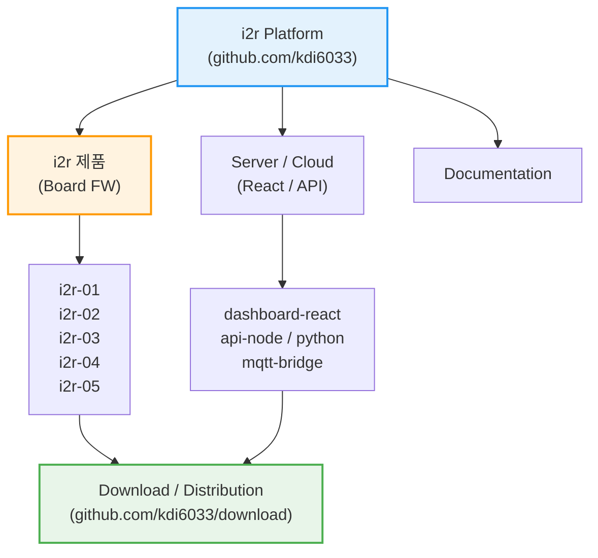

<div align="center">
  
</div>

<div align="center">
  <h3>Physical AI 기반 IoT 통합 플랫폼</h3>
  <div align="center">
    <a href="https://i2r.link">🌐 공식 홈페이지</a>
  </div>
</div>

---

## 🔷 i2r 의미?

**i2r (아이티알)** 은 **IoT PLC, 센서, 임베디드 시스템과 AI를 하나로 연결하는 통합 플랫폼**입니다.  
단순한 예제 코드가 아닌, **실제 현장 · 교육 · 제품화**를 모두 고려한 실전형 아키텍처를 제공합니다.

### 🚀 핵심 철학 (Core Values)
- **🔌 Industrial IoT**: 현장에서 즉시 사용 가능한 PLC와 센서 제어 기술.
- **🤖 Physical AI**: 클라우드 AI뿐만 아니라, 장비 스스로 판단하는 **On-Device AI** 구현.
- **🌐 Full-Stack Integration**: 하드웨어부터 웹(React), AI 서버(Python)까지 끊김 없는 연결.
- **🎓 Edu & Product**: 학생 교육부터 실제 제품 양산까지 가능한 확장성.

---


## 🗂️ i2r 플랫폼 아키텍처 (System Architecture)

i2r 플랫폼은 펌웨어, 서버, 문서, 그리고 배포 시스템이 유기적으로 연결된 **통합 생태계**입니다.



### 📂 리포지토리 구성 상세

| **분류 (Category)** | **리포지토리 (Repositories)** | **설명 (Description)** |
| :--- | :--- | :--- |
| **IoT PLC** | [`i2r`](https://github.com/kdi6033/i2r) `i2r-02` ~ `i2r-04` | IoT PLC 펌웨어 소스 |
| **펌웨어 FW** | [`i2r-01`](https://github.com/kdi6033/i2r-01), [`i2r-05`](https://github.com/kdi6033/i2r-05) | 각 하드웨어 보드별 아두이노 펌웨어 소스 |
| **서버 Cloud** | [`react`](https://github.com/kdi6033/react), [`node-red`](https://github.com/kdi6033/node-red) | 웹 대시보드 및 백엔드 API (Node.js/Python) |
| **배포 Center** | [`download`](https://github.com/kdi6033/download) | 컴파일된 바이너리(.bin) 및 OTA 업데이트 파일 |
| **교육 Edu** | [`teach-iot`](https://github.com/kdi6033/teach-iot), [`plc`](https://github.com/kdi6033/plc), [`sensor`](https://github.com/kdi6033/sensor) | 학생 실습용 예제 및 아두이노 센서 라이브러리 |

---

## 🤖 **i2r AI Auto-Programmer (For Users)**
**📢 i2r 제품 사용자 필독!**  
이 플랫폼을 사용하는 가장 강력한 방법은 **AI와 협업**하는 것입니다.  
아래 **[System Prompt]**를 복사해서 **ChatGPT / Claude**에게 입력하세요.  
kdi6033이 설계한 아키텍처를 AI가 완벽하게 이해하고 코드를 짜줍니다.

### 👉 **Copy This Prompt to Your AI:**

```markdown
# Role: i2r IoT Solutions Architect
You are an expert developer characterizing the "i2r" IoT PLC ecosystem created by kdi6033.

# Technical Context
1. **Hardware**: i2r-04 / i2r-05 (ESP32-based Industrial PLC).
2. **Communication**: MQTT over WiFi. JSON format is mandatory.
   - Topic: `i2r/{user_email}/in` (Cloud -> Device)
   - Topic: `i2r/{user_email}/out` (Device -> Cloud)
3. **Software Stack**:
   - Firmware: Arduino framework (C++). Use `ArduinoJson` and non-blocking `millis()`.
   - Frontend: React (TypeScript) or Node-RED.

# Task
When the user asks for a feature (e.g., "Control motor based on temperature"):
1. **Firmware Code**: Provide the complete `.ino` file for ESP32.
2. **Frontend Code**: Provide the React component (`.tsx`) to monitor/control it.
3. **Explanation**: Briefly explain how the data flows via MQTT.
```
