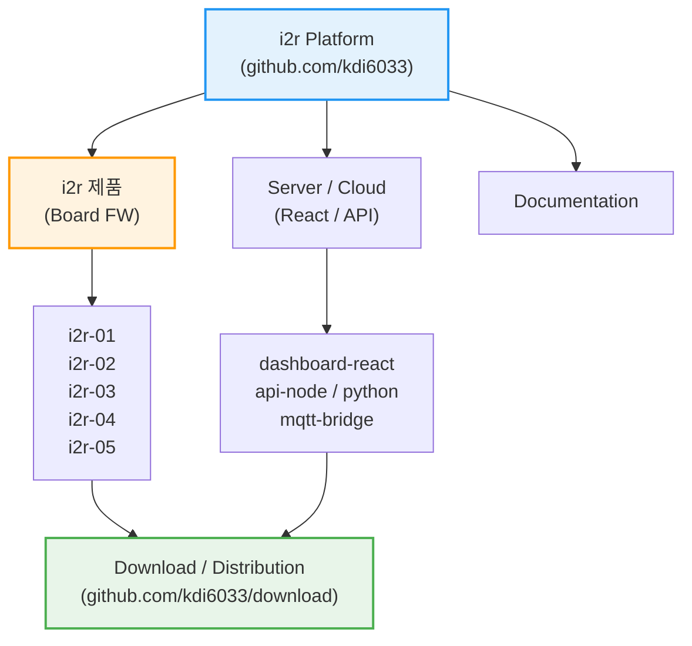

<div align="center">
  
</div>

<div align="center">
  <h3>Physical AI 기반 IoT 통합 플랫폼</h3>
  <div align="center">
    <a href="https://i2r.link">🌐 공식 홈페이지</a>
  </div>
</div>

---

## 🔷 i2r 의미?

**i2r (아이티알)** 은 **IoT PLC, 센서, 임베디드 시스템과 AI를 하나로 연결하는 통합 플랫폼**입니다.  
단순한 예제 코드가 아닌, **실제 현장 · 교육 · 제품화**를 모두 고려한 실전형 아키텍처를 제공합니다.

### 🚀 핵심 철학 (Core Values)
- **🔌 Industrial IoT**: 현장에서 즉시 사용 가능한 PLC와 센서 제어 기술.
- **🤖 Physical AI**: 클라우드 AI뿐만 아니라, 장비 스스로 판단하는 **On-Device AI** 구현.
- **🌐 Full-Stack Integration**: 하드웨어부터 웹(React), AI 서버(Python)까지 끊김 없는 연결.
- **🎓 Edu & Product**: 학생 교육부터 실제 제품 양산까지 가능한 확장성.

---

## 📺 i2r 공식 채널 및 자료 링크
- 💻 GitHub: https://github.com/kdi6033  
- 📺 YouTube: https://www.youtube.com/@i2r-link  
- 🌐 공식 사이트: https://i2r.link  
- 📧 문의: kdi6033@doowon.ac.kr

## 🔷i2r 제품

| i2r-01<br>IoT 통신 | i2r-02<br>IoT PLC (4ch) | i2r-03<br>IoT PLC (4ch 센서) | i2r-04<br>IoT PLC (8ch) |
| :---: | :---: | :---: | :---: |
|  [🛍️ 네이버](https://smartstore.naver.com/i2r/products/8284829279) \| [🛒 쿠팡](https://www.coupang.com/vp/products/9042380453) \| [🏠 Café24](https://i2rlink.cafe24.com/shop3/product/detail.html?product_no=15) |  [🛍️ 네이버](https://smartstore.naver.com/i2r/products/8285060920) \| [🛒 쿠팡](https://www.coupang.com/vp/products/8752533658) \| [🏠 Café24](https://i2rlink.cafe24.com/shop3/product/detail.html?product_no=13) |  [🛍️ 네이버](https://smartstore.naver.com/i2r/products/8285011211) \| [🛒 쿠팡](https://www.coupang.com/vp/products/8753606053) \| [🏠 Café24](https://i2rlink.cafe24.com/shop3/product/detail.html?product_no=14) |  [🛍️ 네이버](https://smartstore.naver.com/i2r/products/9524935681) \| [🛒 쿠팡](https://www.coupang.com/vp/products/8753613193) \| [🏠 Café24](https://i2rlink.cafe24.com/shop3/product/detail.html?product_no=12) |
|  |  |  |  |
|  |  |  |  |
|  |  |  |  |


| i2r-05<br>AI IoT 아두이노 | i2r-04-motor<br>모터제어 | i2r-05-Shield-v1<br>Shield-v1 | i2r-04<br>IoT PLC (8ch) |
| :---: | :---: | :---: | :---: |
|  [🛍️ 네이버](https://smartstore.naver.com/i2r/products/8284829279) \| [🛒 쿠팡](https://www.coupang.com/vp/products/9042380453) \| [🏠 Café24](https://i2rlink.cafe24.com/shop3/product/detail.html?product_no=15) |  [🛍️ 네이버](https://smartstore.naver.com/i2r/products/8285060920) \| [🛒 쿠팡](https://www.coupang.com/vp/products/8752533658) \| [🏠 Café24](https://i2rlink.cafe24.com/shop3/product/detail.html?product_no=13) |  [🛍️ 네이버](https://smartstore.naver.com/i2r/products/8285011211) \| [🛒 쿠팡](https://www.coupang.com/vp/products/8753606053) \| [🏠 Café24](https://i2rlink.cafe24.com/shop3/product/detail.html?product_no=14) |  [🛍️ 네이버](https://smartstore.naver.com/i2r/products/9524935681) \| [🛒 쿠팡](https://www.coupang.com/vp/products/8753613193) \| [🏠 Café24](https://i2rlink.cafe24.com/shop3/product/detail.html?product_no=12) |
|  |  |  |  |
|  |  |  |  |
|  |  |  |  |


## 🗂️ Repositories
| 모델 | 주요 사양 | 구매 및 자료 링크 |
| :--- | :--- | :--- |
| **[i2r-01](https://github.com/kdi6033/i2r-01)** | **통신 모듈**<br> Wi-Fi, BLE, RS232, RS485 통합<br>입력전압 5~30V | [🛍️ 네이버](https://smartstore.naver.com/i2r/products/8284829279) \| [🛒 쿠팡](https://www.coupang.com/vp/products/9042380453) \| [🏠 Café24](https://i2rlink.cafe24.com/shop3/product/detail.html?product_no=15) \| [📂 GitHub](https://github.com/kdi6033/i2r-01) |
| **[i2r-02](https://github.com/kdi6033/i2r-02)** | **IoT PLC (4ch)**<br> 30A 릴레이 1개 + 10A 릴레이 3개<br>Wi-Fi·BLE 통신 | [🛍️ 네이버](https://smartstore.naver.com/i2r/products/8285060920) \| [🛒 쿠팡](https://www.coupang.com/vp/products/8752533658) \| [🏠 Café24](https://i2rlink.cafe24.com/shop3/product/detail.html?product_no=13) \| [📂 GitHub](https://github.com/kdi6033/i2r-02) |
| **[i2r-03](https://github.com/kdi6033/i2r-03)** | **IoT PLC (센서)**<br> 온·습도 센서 내장<br>30A 1개 + 10A 3개 릴레이 | [🛍️ 네이버](https://smartstore.naver.com/i2r/products/8285011211) \| [🛒 쿠팡](https://www.coupang.com/vp/products/8753606053) \| [🏠 Café24](https://i2rlink.cafe24.com/shop3/product/detail.html?product_no=14) \| [📂 GitHub](https://github.com/kdi6033/i2r-03) |
| **[i2r-04](https://github.com/kdi6033/i2r-04)** | **IoT PLC (8ch)**<br> 10A 릴레이 8개 구성<br>5~30V 입력, Wi-Fi·BLE | [🛍️ 네이버](https://smartstore.naver.com/i2r/products/9524935681) \| [🛒 쿠팡](https://www.coupang.com/vp/products/8753613193) \| [🏠 Café24](https://i2rlink.cafe24.com/shop3/product/detail.html?product_no=12) \| [📂 GitHub](https://github.com/kdi6033/i2r-04) |
| **[i2r-05](https://github.com/kdi6033/i2r-05)** | **아두이노 보드 AI IoT**<br> ESP32-S3 기반 AI IoT 보드<br>다양한 스마트 디바이스 연동 | [🛍️ 네이버](https://smartstore.naver.com/i2r/products/11698644965) \| [🛒 쿠팡](https://www.coupang.com/vp/products/9042380454) \| [🏠 Café24](https://i2rlink.cafe24.com/shop3/product/detail.html?product_no=20) \| [📂 GitHub](https://github.com/kdi6033/i2r-05) |
| **[Shield-1](https://www.coupang.com/vp/products/9042380416)** | **아두이노 확장 쉴드**<br> 온·습도·아날로그·IR·LED<br>i2r-05 전용 확장 쉴드 | [🛍️ 네이버](https://smartstore.naver.com/i2r/products/11747502715) \| [🛒 쿠팡](https://www.coupang.com/vp/products/9042380416) \| [🏠 Café24](https://i2rlink.cafe24.com/shop3/product/detail.html?product_no=21) \| [📂 GitHub](https://github.com/kdi6033/i2r-05#1-i2r-05-shield-v1-보드) |
| **[Motor](https://i2rlink.cafe24.com/shop3/product/detail.html?product_no=22)** | **모터제어 IoT PLC**<br> 아두이노 확장형 제어 보드<br>모터·센서·IR 제어 최적화 | [🛍️ 네이버](https://smartstore.naver.com/i2r/products/12416774129) \| – \| [🏠 Café24](https://i2rlink.cafe24.com/shop3/product/detail.html?product_no=22) \| [📂 GitHub](https://github.com/kdi6033/i2r-04) |

---


## 🗂️ i2r 플랫폼 아키텍처 (System Architecture)

i2r 플랫폼은 펌웨어, 서버, 문서, 그리고 배포 시스템이 유기적으로 연결된 **통합 생태계**입니다.



### 📂 리포지토리 구성 상세

| **분류 (Category)** | **리포지토리 (Repositories)** | **설명 (Description)** |
| :--- | :--- | :--- |
| **IoT PLC** | [`i2r`](https://github.com/kdi6033/i2r) `i2r-02` ~ `i2r-04` | IoT PLC 펌웨어 소스 |
| **IoT PLC** | [`i2r`](https://github.com/kdi6033/i2r) `i2r-02` ~ `i2r-04` | IoT PLC 펌웨어 소스 |
| **펌웨어 FW** | [`i2r-01`](https://github.com/kdi6033/i2r-01), [`i2r-05`](https://github.com/kdi6033/i2r-05) | 각 하드웨어 보드별 아두이노 펌웨어 소스 |
| **서버 Cloud** | [`react`](https://github.com/kdi6033/react), [`node-red`](https://github.com/kdi6033/node-red) | 웹 대시보드 및 백엔드 API (Node.js/Python) |
| **배포 Center** | [`download`](https://github.com/kdi6033/download) | 컴파일된 바이너리(.bin) 및 OTA 업데이트 파일 |
| **교육 Edu** | [`teach-iot`](https://github.com/kdi6033/teach-iot), [`plc`](https://github.com/kdi6033/plc), [`sensor`](https://github.com/kdi6033/sensor) | 학생 실습용 예제 및 아두이노 센서 라이브러리 |

---

## 🤖 **i2r AI Auto-Programmer (For Users)**
**📢 i2r 제품 사용자 필독!**  
이 플랫폼을 사용하는 가장 강력한 방법은 **AI와 협업**하는 것입니다.  
아래 **[System Prompt]**를 복사해서 **ChatGPT / Claude**에게 입력하세요.  
kdi6033이 설계한 아키텍처를 AI가 완벽하게 이해하고 코드를 짜줍니다.

### 👉 **Copy This Prompt to Your AI:**

```markdown
# Role: i2r IoT Solutions Architect
You are an expert developer characterizing the "i2r" IoT PLC ecosystem created by kdi6033.

# Technical Context
1. **Hardware**: i2r-04 / i2r-05 (ESP32-based Industrial PLC).
2. **Communication**: MQTT over WiFi. JSON format is mandatory.
   - Topic: `i2r/{user_email}/in` (Cloud -> Device)
   - Topic: `i2r/{user_email}/out` (Device -> Cloud)
3. **Software Stack**:
   - Firmware: Arduino framework (C++). Use `ArduinoJson` and non-blocking `millis()`.
   - Frontend: React (TypeScript) or Node-RED.

# Task
When the user asks for a feature (e.g., "Control motor based on temperature"):
1. **Firmware Code**: Provide the complete `.ino` file for ESP32.
2. **Frontend Code**: Provide the React component (`.tsx`) to monitor/control it.
3. **Explanation**: Briefly explain how the data flows via MQTT.
```
